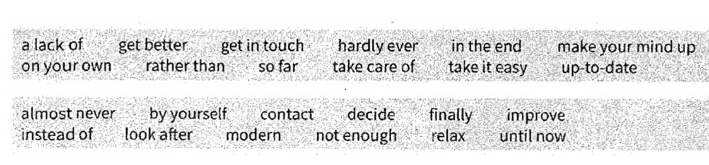
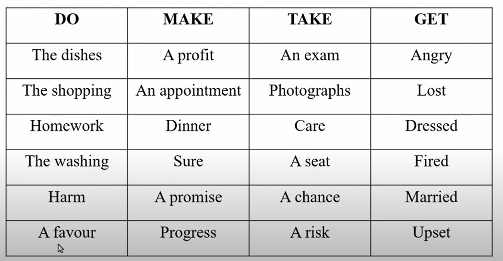
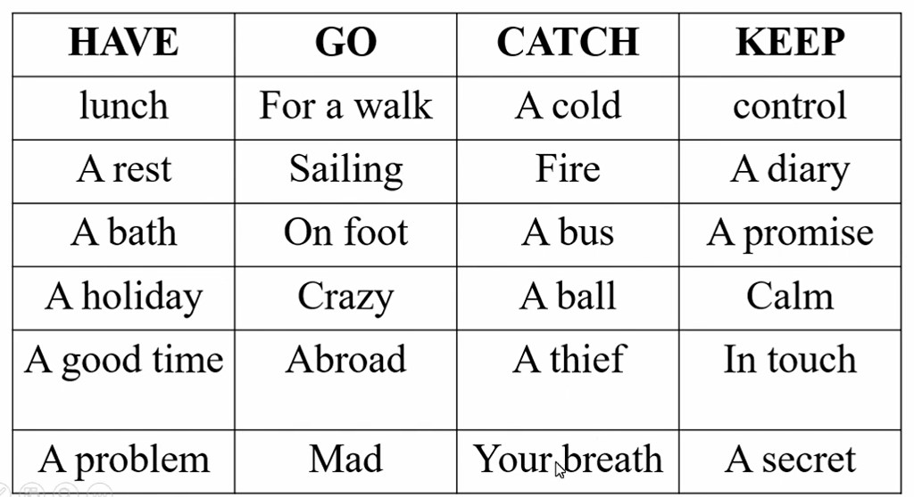
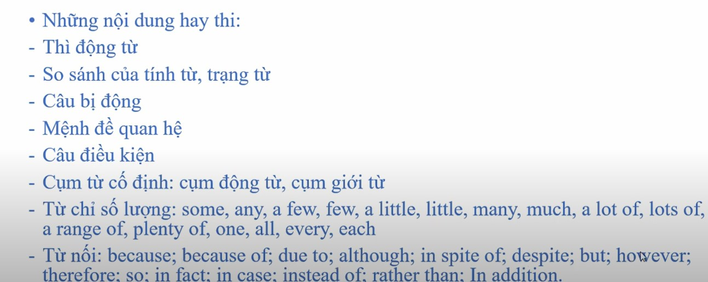
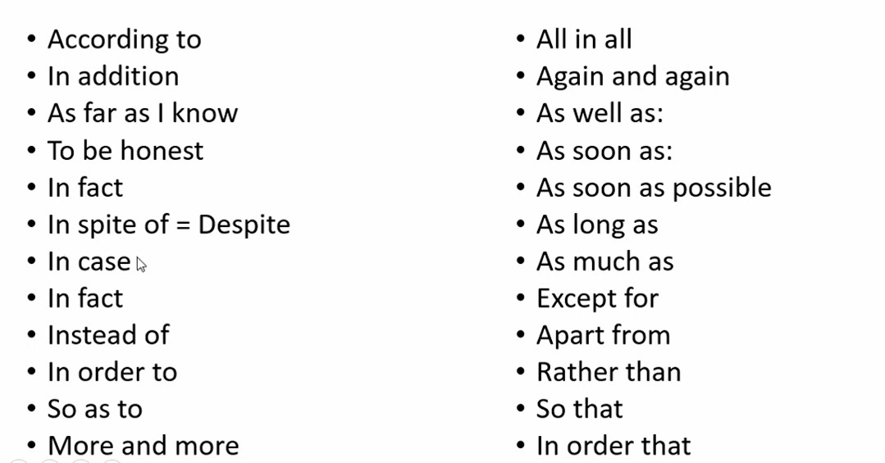

# Experience of Reading

## General

- Choose the **same meaning**. Don't choose the **same word**.
- **Exclude wrong answer** to choose correct answer.

## Part 2

- Underline **3 main** requests. Have **all conditions**.

## Part 4

- Focus on **Conjunctions**.

- Images

## Part 5

- Images

## Part 6

- Images

