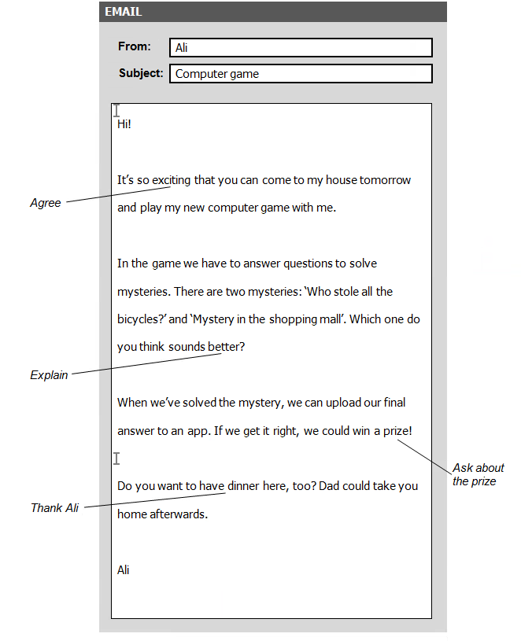

# An email: A detective game
Read this email from your English-speaking friend, Ali, and the notes you have made.
Write your email to Ali in about 100 words, using all the notes.



```
Dear Ali,
Thank you for inviting me to your house tomorrow. I like playing game and I think we will have some fun together.
For me, I would like to answer the mystery 'Who stole all the bicycles?' becasue it can be easier than the remaining mystery.
It's great that we can win a prize. What is it? I hope it will be a big prize.
As for, thanks for the dinner. What time can I be your house? I am a vegetarian but I do eat fish and beef too.
See you soon,
Nam.
```